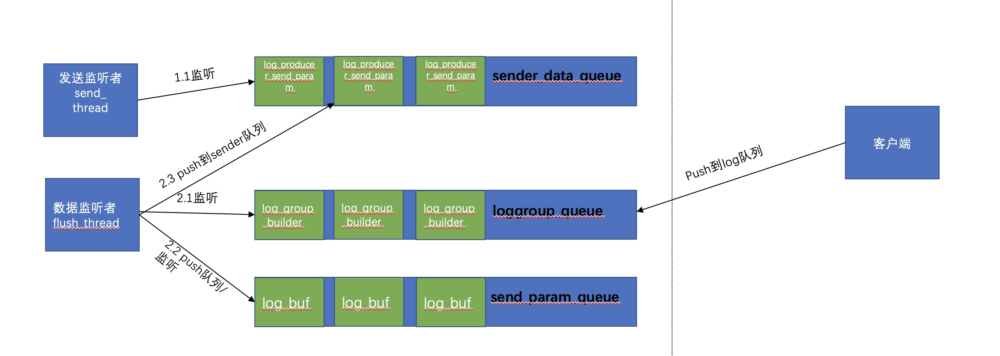

# tencentcloud-cls-sdk-c
### 功能特点

* 异步
    * 异步写入，客户端线程无阻塞
* 聚合&压缩 上传
    * 支持按超时时间、日志数、日志size聚合数据发送
    * 支持lz4压缩
* 缓存
    * 支持缓存上限可设置
    * 超过上限后日志写入失败


- 核心上报架构



### 环境依赖

C Producer使用curl进行网络操作，您需要确认这些库已经安装，并且将它们的头文件目录和库文件目录都加入到了项目中。

### libcurl下载以及安装

libcurl建议 7.49.0 及以上版本

### LOG C SDK的安装

安装时请在cmake命令中指定第三方库头文件以及库文件的路径，编译命令如下：

```
    cmake .
    make
    make install
```

### 配置参数

| 参数                         | 说明                                                         |                             取值                             |
| ---------------------------- | ------------------------------------------------------------ | :----------------------------------------------------------: |
| topic                        | 日志主题 ID ，通过接口SetTopic设置                           | 可在控制台获取https://console.cloud.tencent.com/cls/logset/desc |
| accessKeyId                  | 通过接口setAccessKeyId设置                                   | 参考官网文档：https://cloud.tencent.com/document/product/614/12445 |
| accessKey                    | 通过接口setAccessKeySecret设置                               | 参考官网文档：https://cloud.tencent.com/document/product/614/12445 |
| endpoint                     | 地域信息。通过接口setEndpoint设置，                          | 参考官方文档：https://cloud.tencent.com/document/product/614/18940 |
| logBytesPerPackage           | 缓存的日志包的大小上限，取值为1~5242880，单位为字节。默认为1024 * 1024。通过SetPackageLogBytes接口设置 |                        整数，单位字节                        |
| logCountPerPackage           | 缓存的日志包中包含日志数量的最大值，取值为1~10000，默认为1024条。通过SetPackageLogCount接口设置 |                             整数                             |
| packageTimeoutInMS           | 日志的发送逗留时间，如果缓存超时，则会被立即发送，单位为毫秒，默认为3000。通过SetPackageTimeout接口设置 |                        整数，单位毫秒                        |
| maxBufferBytes               | 单个Producer Client实例可以使用的内存的上限，超出缓存时add_log接口会立即返回失败。通过接口SetMaxBufferLimit设置 |                        整数，单位字节                        |
| sendThreadCount              | 发送线程数，默认为1。通过接口SetSendThreadCount设置          |                             整数                             |
| connectTimeoutSec            | 网络连接超时时间，默认为10s。通过接口SetConnectTimeoutSec设置 |                         整数，单位秒                         |
| sendTimeoutSec               | 读写超时，默认为15s。通过接口SetSendTimeoutSec设置           |                         整数，单位秒                         |
| destroyFlusherWaitTimeoutSec | flusher线程销毁最大等待时间，默认为1s。通过接口SetDestroyFlusherWaitSec设置 |                         整数，单位秒                         |
| destroySenderWaitTimeoutSec  | sender线程池销毁最大等待时间，默认为1s。通过接口SetDestroySenderWaitSec设置 |                         整数，单位秒                         |
| compressType                 | 数据上传时的压缩类型，默认为LZ4压缩，默认为1s。通过接口SetCompressType设置 |                0 不压缩，1 LZ4压缩， 默认为1                 |

### 使用demo

```
    if (ClsLogProducerInit(LOG_GLOBAL_ALL) != LOG_PRODUCER_OK)
    {
        printf("ClsLogProducerInit init fail \n");
        exit(1);
    }
    ProducerConfig *config = ConstructLogConfig();
    SetEndpoint(config, "ap-guangzhou.cls.tencentcs.com");
    SetAccessId(config, "");
    SetAccessKey(config, "");
    SetTopic(config, "");
    SetPackageLogBytes(config, 4 * 1024 * 1024);
    setPackageTimeout(config, 3000);
    SetMaxBufferLimit(config, 64 * 1024 * 1024);
    set_send_thread_count(config, 4);
    SetCompressType(config, 1);
    SetConnectTtimeoutSec(config, 10);
    SetSendTimeoutSec(config, 15);
    clslogproducer *producer = ConstructorClsLogProducer(config, notifyFunc, NULL);
    if (producer == NULL)
    {
        printf("create log producer by config fail \n");
        exit(1);
    }

    clslogproducerclient *client = GetClsLogProducer(producer, NULL);
    if (client == NULL)
    {
        printf("create log producer client by config fail \n");
        exit(1);
    }
 		char indexStr[32];
    sprintf(indexStr, "%d", i);

    int rst = PostClsLog(client, 20, "key1", "value_1",
                             "key2", "value_2",
                             "key3", "value_3",
                             "key4", "value_4",
                             "key5", "value_5",
                             "key6", "value_6",
                             "key7", "value_7",
                             "key8", "value_8",
                             "key9", "value_9",
                             "index", indexStr);
    if (rst != LOG_PRODUCER_OK)
    {
       printf("add log error %d \n", rst);
    }
    DestructorClsLogProducer(producer);

    ClsLogProducerDestroy();
```

